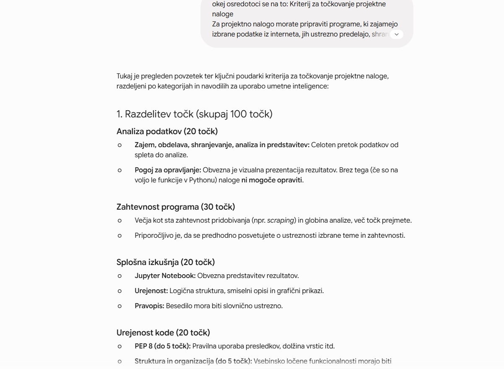
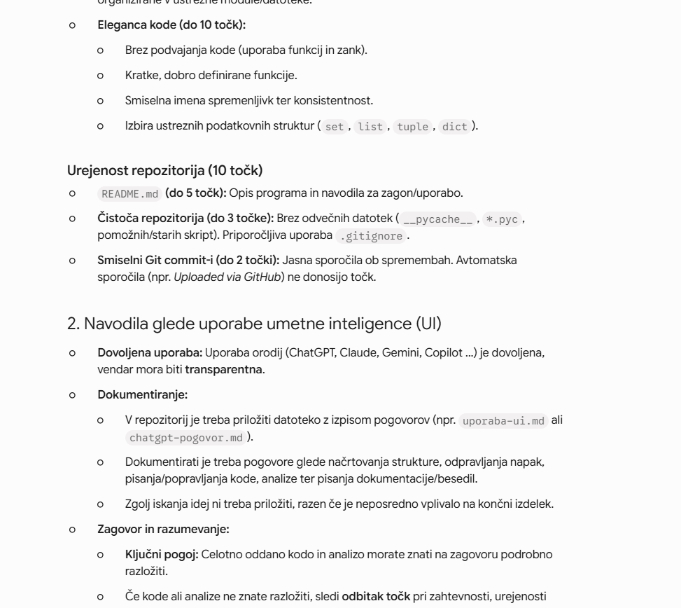
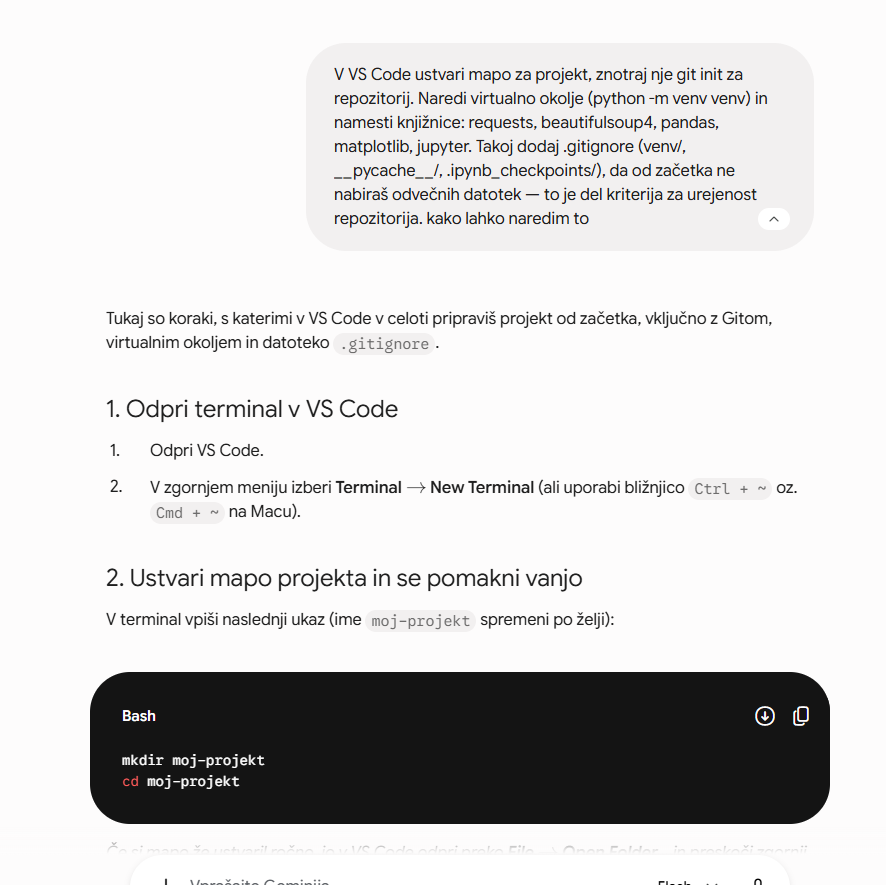
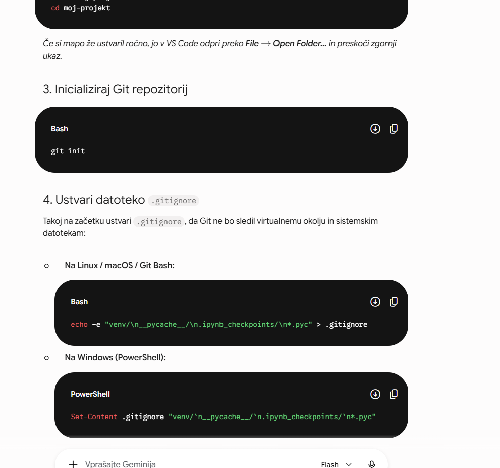
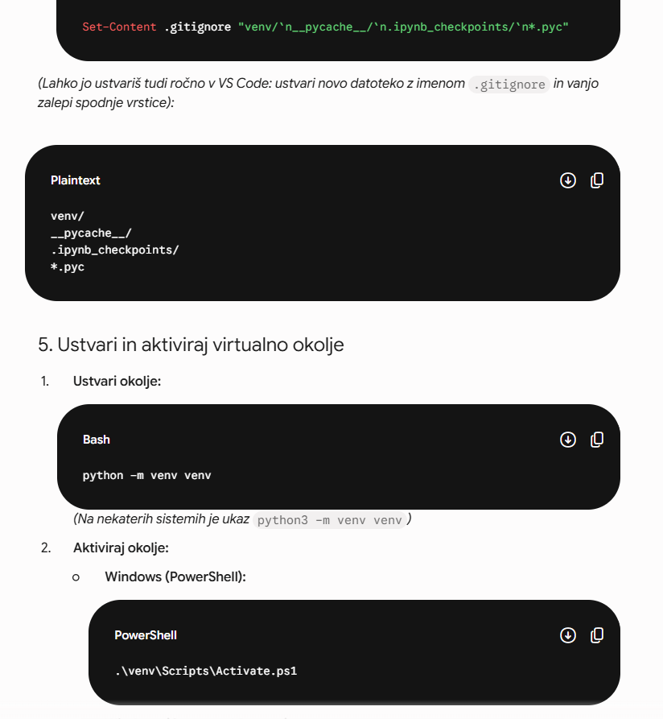

# Dokumentacija uporabe umetne inteligence (UI)

## 1. Nastavitev okolja in repozitorija
- **Orodje:** Gemini
     

## 2. Zajem podatkov (Scraping)
- **Orodje:** Gemini
- **Namen:** Pomoč pri analizi HTML strukture spletne strani `albumoftheyear.org` (selektorji `.albumListRow`, `.albumListTitle`) ter pisanju Python skripte (`zajem.py`) z uporabo `requests`, `BeautifulSoup` in `pandas`.

Claude mi je pomagal pri naslednjih zadevah:
ko sem napisal locene kode, sem ga vprašal za mnenje:
"Kako komentiraš do zdaj narejene kode?", pastal sem mu jih.
zajem.py ima mrtvo, podvojeno kodo. Funkcija obdelaj_strani() počne skoraj isto kot izluscenje.py + naredi_csv.py, samo s slabšimi podatki (manjkajo leto, žanri, št. recenzij), in je main.py sploh ne kliče. To je natanko tisto, kar kriterij kaznuje pod "elegantna koda" (ponavljajoča se, neuporabljena koda). Zbriši obdelaj_strani() iz zajem.py in tudi nepotreben import pandas as pd tam zgoraj.
Potem sem ga vprašal za mnenje, kako naj pišem tekst v Jupitru: "pac zanima me tudi, ce mislis da je bols da je ta tekst, pac to kjer pisem komentarje napisan kot code ali ce je napisan kot obicen tekst zgoraj, kjer moras dvakrat left klikniti da ga lahko urejas"
Mislim, da je za to specifično uporabo (interpretacija/komentar) boljša navadna markdown celica, ne koda.
Nato sem ga vprašal kaj si misli o tem kako so razporejeni albumi na tisti spletni strani: "zanima me se pac kako je razporejenih teh 500 albumov ali po kaksnem vrstem redu ali so pac cisto na random, ker nocem da to unici zdj kej pri analizi"
Dober ulov — imaš prav, ni strogo padajoče po prikazani (zaokroženi) oceni. Najverjetnejša razlaga: AOTY albumov na tej lestvici ne razvršča zgolj po surovi oceni, ampak po neki uteženi/Bayesovi formuli, ki upošteva tudi število recenzij — podobno kot IMDb-jeva znana "weighted rating" formula za svoj Top 250. --- to sem uporabil nato pri uvodu

